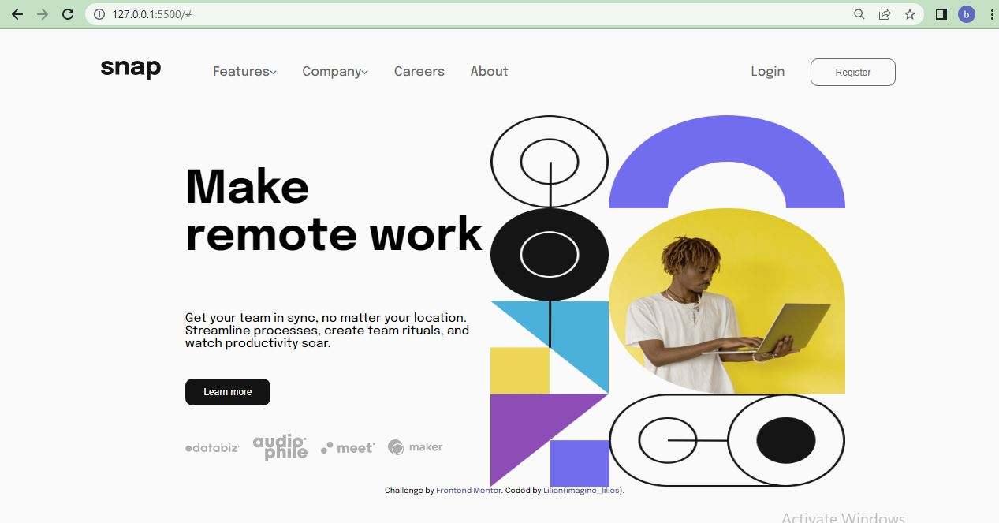

# Frontend Mentor - Intro section with dropdown navigation solution

This is a solution to the [Intro section with dropdown navigation challenge on Frontend Mentor](https://www.frontendmentor.io/challenges/intro-section-with-dropdown-navigation-ryaPetHE5). Frontend Mentor challenges help you improve your coding skills by building realistic projects. 

## Table of contents

- [Overview](#overview)
  - [The challenge](#the-challenge)
  - [Screenshot](#screenshot)
  - [Links](#links)
- [My process](#my-process)
  - [Built with](#built-with)
  - [What I learned](#what-i-learned)
  - [Continued development](#continued-development)
  - [Useful resources](#useful-resources)
- [Author](#author)
- [Acknowledgments](#acknowledgments)


## Overview

### The challenge

Users should be able to:

- View the relevant dropdown menus on desktop and mobile when interacting with the navigation links
- View the optimal layout for the content depending on their device's screen size
- See hover states for all interactive elements on the page

### Screenshot



### Links

- Solution URL: [Add solution URL here](https://your-solution-url.com)
- Live Site URL: [Add live site URL here](https://your-live-site-url.com)

## My process

### Built with

- Semantic HTML5 markup
- CSS custom properties
- Flexbox
- Mobile-first workflow
- JS

### What I learned

Building this has deepen my understanding on how to utilize the use of media query.

To see how you can add code snippets, see below:

```html
                <div class="dropdown">
                  <div class="toggle">
                    <a href="#" class="nav-links">Company</a>
                    
                  </div>
                  <div class="sub-nav second">
                    <ul>
                      <li><a href="#">History</a></li>
                      <li><a href="#">Our Team</a></li>
                      <li><a href="#">Blog</a></li>
                    </ul>
                  </div>
```
```css
.sub-nav {
        position: absolute;
        display: none;
        box-shadow: 1px 3px 8px 8px hsla(0, 0%, 41%, 0.2);
        border-radius: 10px;
        margin-top: 0.5em;
        padding: 0 1em;
        background: hsl(0, 0%, 98%);
        margin-left: 0.5em;
    }
```
```js
toogleNav.addEventListener("click", () => {
        arrow.classList.toggle("nav-icon-rotate");
        subnav.classList.toggle("sub-nav-open");
    });
```

### Continued development

I will continue to practice the use of 
media queries for my webpage to be responsive on all screen sizes.


## Author

- Frontend Mentor - [@Lilee52](https://www.frontendmentor.io/profile/Lilee52)
- Twitter - [@imagine_lilies](https://www.twitter.com/imagine_lilies)


