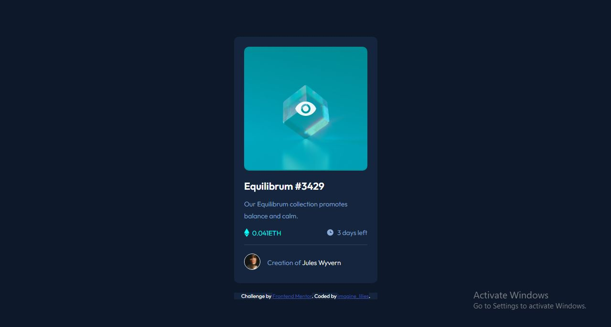

# Frontend Mentor - NFT preview card component solution

This is a solution to the [NFT preview card component challenge on Frontend Mentor](https://www.frontendmentor.io/challenges/nft-preview-card-component-SbdUL_w0U). Frontend Mentor challenges help you improve your coding skills by building realistic projects. 

## Table of contents

- [Overview](#overview)
  - [The challenge](#the-challenge)
  - [Screenshot](#screenshot)
  - [Links](#links)
  - [Built with](#built-with)
  - [What I learned](#what-i-learned)
  - [Continued development](#continued-development)
  - [Useful resources](#useful-resources)
- [Author](#author)


## Overview

### The challenge

Users should be able to:

- View the optimal layout depending on their device's screen size
- See hover states for interactive elements

### Screenshot



### Links

- Solution URL: [Add solution URL here](https://your-solution-url.com)
- Live Site URL: [Add live site URL here](https://your-live-site-url.com)

### Built with

- Semantic HTML5 markup
- CSS custom properties
- Flexbox
- Mobile-first workflow

### What I learned
I learnt  how to create an overlay over a image.

To see how you can add code snippets, see below:

```html
 <div class="card">
        <div class="img-container">
          
          <div class="overlay">
            
          </div>
        </div>
```
```css
.overlay {
  opacity: 0;
  width: 100%;
  background-color: hsla(178, 100%, 50%, 0.5);
  top: 0;
  height: 282px;
  border-radius: 10px;
  position: absolute;
}
```

### Continued development
This is my first time creating an overlay over a 
 with an icon I'll keep practicing on how to perfect it

### Useful resources

- [https.//www.w3schools.com] - w3school helped me on the direction to go regarding the blurred overlay and icon over the image.

## Author

- Frontend Mentor - [@Lilee52](https://www.frontendmentor.io/profile/Lilee52)
- Twitter - [@imagine_lilies](https://www.twitter.com/imagine_lilies)
