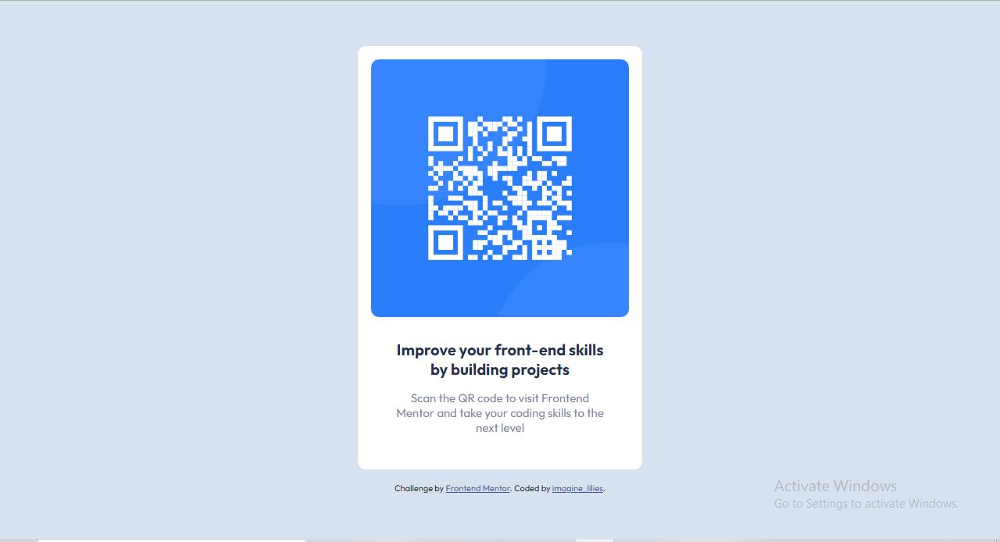

# Frontend Mentor - QR code component solution

This is a solution to the [QR code component challenge on Frontend Mentor](https://www.frontendmentor.io/challenges/qr-code-component-iux_sIO_H). Frontend Mentor challenges help you improve your coding skills by building realistic projects. 

## Table of contents

  - [Screenshot](#screenshot)
  - [Links](#links)
- [My process](#my-process)
  - [Built with](#built-with)
  - [What I learned](#what-i-learned)
  - [Continued development](#continued-development)
  - [Useful resources](#useful-resources)
- [Author](#author)


### Screenshot



### Links

- Solution URL:(https://github.com/Lilee52/Frontend-Mentor/tree/main/qr-code-component-main)
- Live Site URL:(https://lilee52.github.io/Frontend-Mentor/qr-code-component-main/)

## My process

### Built with

- Semantic HTML5 markup
- CSS custom properties
- Flexbox
- Mobile-first workflow

### Code snippets


```html
      <div class="container">
        <div class="img-wrapper">
          
        </div>
```
```css
.img-wrapper {
  max-width: 100%;
  margin: 0 auto;
  border-radius: 10px;
}
```

## Author

- Frontend Mentor - [@Lilee52](https://www.frontendmentor.io/profile/Lilee52)
- Twitter - [@imagine_lilies](https://www.twitter.com/imagine_lilies)